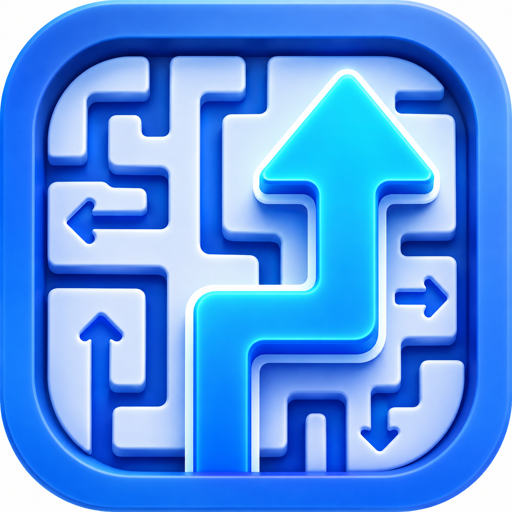
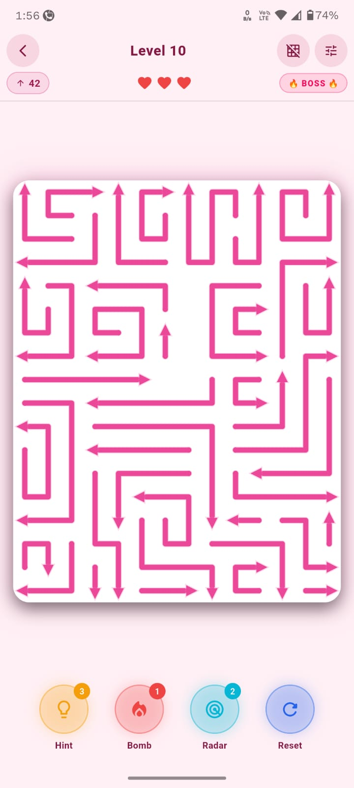
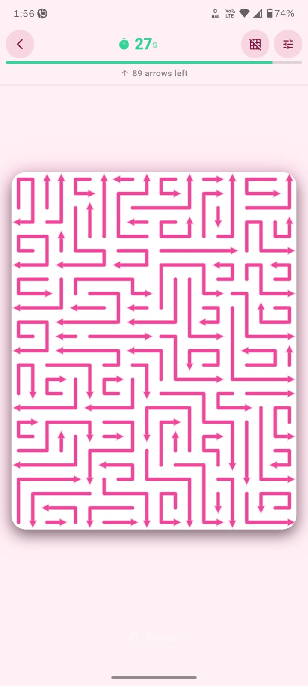
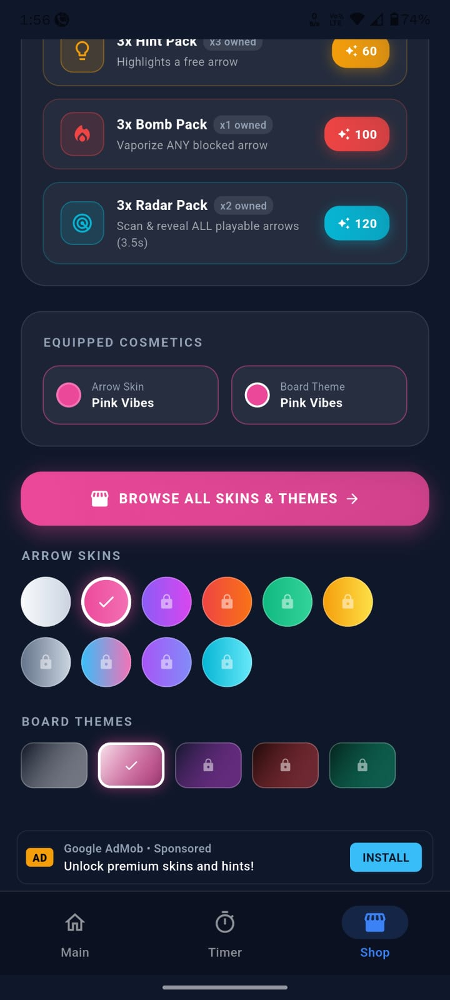
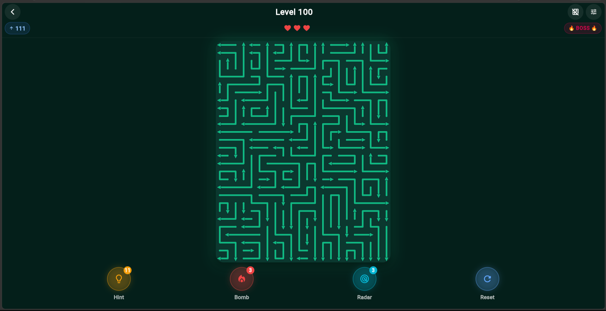
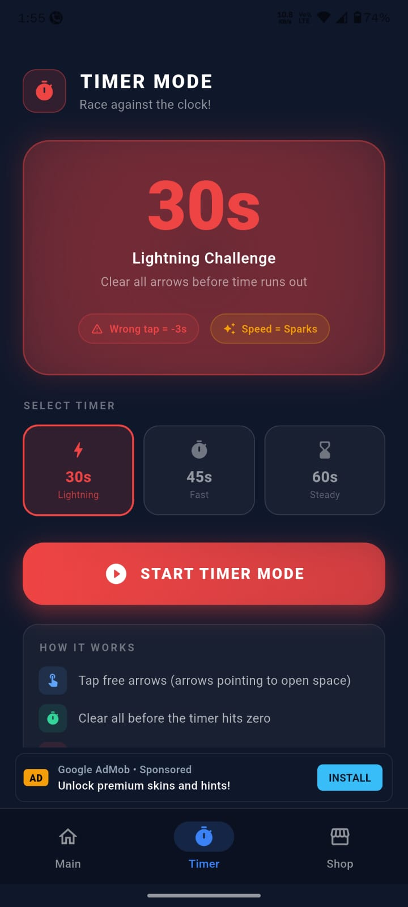
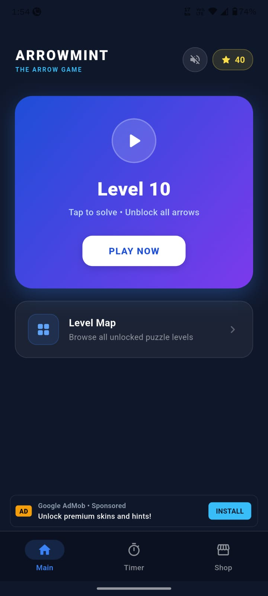

# 🏹 ArrowMint - The Arrow Game

<p align="center">
  
</p>

<p align="center">
  <strong>A relaxing, satisfying minimalist zen arrow puzzle game. Untangle intricate multi-directional labyrinths, trigger chain-reaction combos, and find your flow.</strong>
</p>

<p align="center">
  
  
  
  
  
</p>

---

## 📱 Screenshots

<div align="center">
  <table>
    <tr>
      <td width="33%" align="center">
        <br/>
        <strong>Boss Level Challenge</strong>
      </td>
      <td width="33%" align="center">
        <br/>
        <strong>Timer Rush Mode</strong>
      </td>
      <td width="33%" align="center">
        <br/>
        <strong>Dense Labyrinth Grid</strong>
      </td>
    </tr>
    <tr>
      <td width="33%" align="center">
        <br/>
        <strong>Tablet / Landscape Layout</strong>
      </td>
      <td width="33%" align="center">
        <br/>
        <strong>Victory & Sparks Reward</strong>
      </td>
      <td width="33%" align="center">
        <br/>
        <strong>Themes & Ability Shop</strong>
      </td>
    </tr>
  </table>
</div>

---

## ✨ Features

- **🧩 1,000+ Deterministic Puzzles**: Every single layout is verified by an automated reverse-path solver. 100% solvable, zero dead-ends.
- **⚡ Dynamic Combo Engine**: Rapid consecutive clears build up momentum multipliers and unlock **FLOW STATE** with ascending musical harmony.
- **🎵 Zen Acoustic Soundscape**: Procedural kalimba plucks, warm harmonic pads, and calming SFX in 432Hz tuning.
- **💣 Tactical Power-Ups**:
  - 📡 **Radar Scan**: Highlights immediate open escape paths.
  - 💣 **Bomb**: Clears blocking arrows to unfreeze difficult chokepoints.
  - 💡 **Hint**: Instantly guides the next optimal move.
- **🎨 Themes & Customization**: Unlock Mint Neumorphism, Cyberpunk Neon, Pastel Dreams, and custom arrow styles in the Sparks Shop.
- **⏱️ Timer & Boss Modes**: Fast-paced sprint modes for players looking for an adrenaline-fueled challenge.
- **📴 100% Offline Support**: Play anywhere without an active internet connection.

---

## 🛠️ Architecture & Tech Stack

```
arrow-game/
├── arrow_flow/                      # Core Flutter project
│   ├── lib/
│   │   ├── core/                   # Theme, Router, Audio, Haptics, Ads & IAP
│   │   ├── data/                   # Models, Repositories, Level Generators
│   │   ├── domain/                 # Arrow Solver, Combo Engine, Economy Engine
│   │   └── presentation/           # Screens (Gameplay, Level Select, Shop, Settings)
│   ├── android/                    # Android native app with AdMob preloading
│   └── test/                       # 46 automated compliance & unit test suites
├── screenshots/                    # High-res gameplay and UI screenshots
├── site/                           # Marketing website, Privacy Policy & Terms
└── config/                         # Central game configuration & AdMob configs
```

### Core Technologies:
- **Framework**: [Flutter](https://flutter.dev) (SDK 3.29+)
- **State Management**: `flutter_riverpod` (v2.6.1)
- **Local Persistence**: `shared_preferences` & `hive_flutter`
- **Audio & Haptics**: `audioplayers` with native Android audio-focus isolation
- **Monetization**: Google Mobile Ads SDK (AdMob) with pre-caching & multi-tier fallbacks

---

## 🚀 Getting Started

### Prerequisites
- [Flutter SDK](https://flutter.dev/docs/get-started/install) (3.24.0+)
- [Android Studio / JDK 17+](https://developer.android.com/studio)

### Installation
```bash
# Clone the repository
git clone https://github.com/MrSpideyNihal/arrow-game.git
cd arrow-game/arrow_flow

# Install Flutter dependencies
flutter pub get

# Run all automated test suites
flutter test

# Run in debug mode on connected device
flutter run
```

---

## 📦 Building for Production

```bash
cd arrow_flow

# Build Google Play App Bundle (AAB)
flutter build appbundle --release

# Build Split-Per-ABI APKs
flutter build apk --release --split-per-abi

# Build Universal APK
flutter build apk --release
```

---

## 📜 Privacy & Compliance

- **Privacy Policy**: Hosted at [`site/privacy/index.html`](site/privacy/index.html)
- **Data Safety**: Discloses Advertising ID (AAID) and crash analytics used by Google AdMob. No personal data/PII collected.
- **COPPA & GDPR Compliant**: Standard child-directed safeguards configured.

---

## 📄 License

This project is licensed under the [MIT License](LICENSE).
